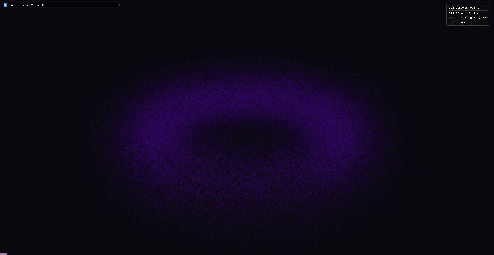
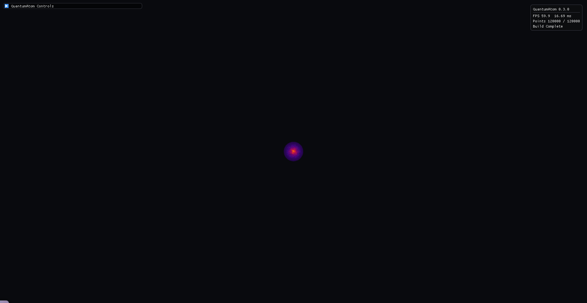
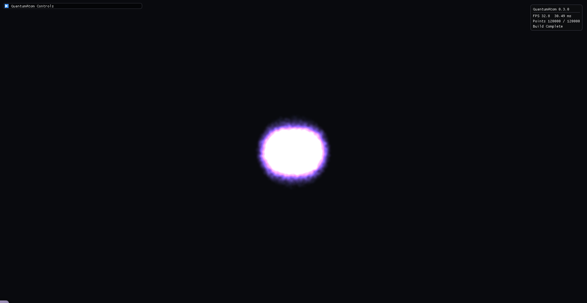
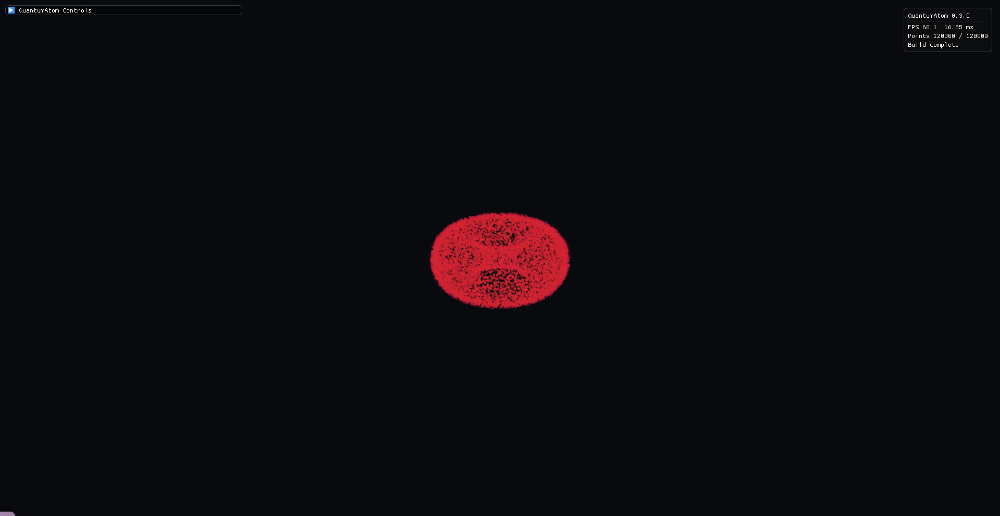
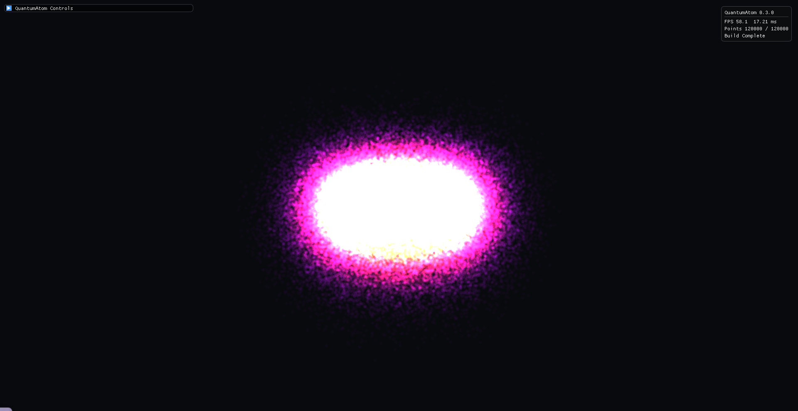

# QuantumAtom


Real-time C++23 and OpenGL visualizer for hydrogen-like atomic orbitals.

QuantumAtom renders analytical hydrogen-like wavefunctions as interactive 3D probability clouds. It is built for fast educational exploration: choose quantum numbers, watch the cloud regenerate in the background, switch rendering modes, clip into the orbital, and export screenshots.

<p align="center">
  
</p>

## Features

- Hydrogen-like orbital visualization up to `n = 8`.
- Responsive high-`n` generation with background workers, preview clouds, progressive refinement, and cache reuse.
- OpenGL point-cloud renderer with shader-side clipping, density thresholding, colormaps, phase animation, and glow effects.
- Rendering modes:
  - density points
  - glowing billboards
  - iso-density shell
  - phase flow
  - volumetric halo
- Scientific colormaps: inferno, viridis, plasma, magma, and cividis.
- Dear ImGui control panel with tabs for quantum numbers, rendering, camera, export, and physics notes.
- Orbital presets from `1s` through high angular-momentum `n=8` states.
- PNG screenshot export using `stb_image_write`.
- Runtime configuration through `config/QuantumAtom.ini`.
- CMake install rules, CPack packages, and GitHub Actions builds for Windows, Linux, and macOS.

## Quick Start

```bash
cmake -S . -B build -DCMAKE_BUILD_TYPE=Release
cmake --build build --config Release --parallel
```

Run the executable from the build tree:

```bash
./build/QuantumAtom
```

On Windows, the executable is usually:

```powershell
.\build\QuantumAtom.exe
```

The build copies `shaders/` and `config/` beside the executable. Keep those folders next to the app when distributing it.

## Controls

| Input | Action |
| --- | --- |
| Left mouse drag | Orbit camera |
| Right mouse drag | Pan camera |
| Shift + left mouse drag | Pan camera |
| Mouse wheel | Zoom |
| Up / Down | Change `n` |
| `C` | Toggle clipping |
| `S` | Save PNG screenshot |
| `R` or Space | Reset the app to launch state |
| ImGui tabs | Edit quantum numbers, rendering, camera, export, and info settings |

## UI Overview

The control panel is split into focused tabs:

| Tab | Purpose |
| --- | --- |
| Quantum Numbers | Select `n`, `l`, `m`, or use orbital presets |
| Rendering | Change render mode, colormap, point count, thresholds, clipping, colors, and theme |
| Camera | Adjust yaw, pitch, distance, smoothing, and reset the view |
| Export | Save screenshots and clear cached clouds |
| Info | Read the orbital formula and a short physics explanation |

## Physics Model

QuantumAtom visualizes a single-electron hydrogen-like orbital:

```text
psi_nlm(r, theta, phi) = R_nl(r) Y_l^m(theta, phi)
rho(r, theta, phi) = |psi_nlm(r, theta, phi)|^2
```

The radial component uses associated Laguerre polynomials. The angular component uses normalized associated Legendre polynomials for the spherical harmonic probability.

For rendering, QuantumAtom samples `rho * r^2` on a radial/theta density grid, then samples `phi` uniformly. This avoids the worst stalls of raw rejection sampling and keeps high-`n` orbitals usable.

This is an educational visualization of analytical orbitals, not a many-electron chemistry solver.

## Build Requirements

- CMake 3.24 or newer
- C++23 compiler
- OpenGL 3.3 capable GPU/driver
- Git, if CMake needs to fetch dependencies
- Ninja is recommended but not required

### Linux

Ubuntu runners and common desktop installs need X11/OpenGL development packages:

```bash
sudo apt-get update
sudo apt-get install -y ninja-build pkg-config xorg-dev libglu1-mesa-dev
cmake -S . -B build -G Ninja -DCMAKE_BUILD_TYPE=Release
cmake --build build --parallel
```

When GLFW is fetched by CMake on Linux, QuantumAtom builds GLFW's X11 backend and disables Wayland in that fallback path. This keeps CI and clean Ubuntu builds from requiring `wayland-scanner`.

### Windows with MSYS2 UCRT

```powershell
$env:PATH = "C:\msys64\ucrt64\bin;$env:PATH"
cmake -S . -B build -G Ninja `
  -DCMAKE_C_COMPILER=C:/msys64/ucrt64/bin/gcc.exe `
  -DCMAKE_CXX_COMPILER=C:/msys64/ucrt64/bin/g++.exe `
  -DCMAKE_BUILD_TYPE=Release
cmake --build build --parallel
```

### macOS

```bash
brew install cmake ninja
cmake -S . -B build -G Ninja -DCMAKE_BUILD_TYPE=Release
cmake --build build --parallel
```

## Dependencies

CMake first tries installed packages, including packages provided by a vcpkg toolchain. If they are not available, the project falls back to bundled or fetched dependencies.

| Dependency | Use |
| --- | --- |
| GLFW | Windowing and input |
| GLAD | OpenGL function loading |
| GLM | Vector and matrix math |
| Dear ImGui | Runtime UI |
| stb_image_write | PNG screenshot export |

The tracked `third_party/glad` loader keeps OpenGL setup predictable even without a package manager.

## CMake Options

| Option | Default | Description |
| --- | --- | --- |
| `QUANTUMATOM_MAX_N` | `8` | Maximum principal quantum number |
| `QUANTUMATOM_DEFAULT_POINTS` | `120000` | Startup point-cloud budget |
| `QUANTUMATOM_WITH_DEBUG_SYMBOLS` | `ON` | Emit symbols for optimized builds |
| `QUANTUMATOM_FETCH_DEPS` | `ON` | Fetch missing dependencies |
| `QUANTUMATOM_STATIC_MINGW_RUNTIME` | `ON` | Statically link MinGW runtime libraries |

Example:

```bash
cmake -S . -B build -DCMAKE_BUILD_TYPE=Release -DQUANTUMATOM_MAX_N=8 -DQUANTUMATOM_DEFAULT_POINTS=250000
```

## Install and Package

```bash
cmake --install build --config Release --prefix dist/QuantumAtom
cmake --build build --target package --config Release
```

CPack creates `.zip` and `.tar.gz` packages containing the executable, shaders, default config, samples, docs, README, and license.

## Runtime Configuration

Defaults live in `config/QuantumAtom.ini`. The app searches common build/install locations at startup and saves current UI defaults on shutdown.

Common fields:

```ini
pointCount=120000
densityThreshold=0.0
pointSize=7.0
clipEnabled=false
clipMode=2
renderMode=0
colorMap=0
theme=0
backgroundColor=0.035,0.04,0.055
```

Clip modes:

| Value | Mode |
| --- | --- |
| `0` | Adjustable X plane |
| `1` | Positive X/Y quadrant |
| `2` | Positive X/Y/Z octant |

## Performance Notes

High principal quantum numbers are expensive because the orbital radius and node count grow quickly. QuantumAtom keeps the interface responsive by:

- generating clouds on a background thread;
- limiting density-grid work for high `n`;
- showing a lower-resolution preview before full refinement;
- caching finished `(n, l, m, pointCount)` clouds;
- keeping clipping, colormaps, thresholding, and render modes on the GPU.

For older integrated GPUs, start around `100000` to `200000` points. Increase the point count after the target orbital is cached. The UI limit is `600000` points.

## Gallery and Screenshots

Screenshots are written to `screenshots/` from the Export tab or by pressing `S`.

Tracked README media lives in `docs/media/`. The gallery below was captured from the native app in a maximized desktop window.

| 1s density | 2p+ phase flow |
| --- | --- |
|  |  |

| 3d+ iso shell | 4f+ glowing billboards |
| --- | --- |
|  |  |

| 8k+ volumetric halo |
| --- |
|  |

## Repository Layout

```text
include/core/          Engine and runtime configuration
include/math/          Quantum probability calculations
include/utils/         Camera, shared types, shader loading, OpenGL loader include
src/core/              Engine and config implementations
shaders/               GLSL 330 renderer programs
config/                Default runtime settings
samples/               Small educational/sample data files
docs/media/            README and release screenshots
.github/workflows/     CI and packaging workflow
```

For a guided architecture walkthrough, read `src/HowItWorks.cpp`.

## Releases

The GitHub Actions workflow builds Release packages for Windows, Linux, and macOS. Pull requests and pushes produce build artifacts. Tags matching `v*` publish a GitHub Release with generated notes and packaged artifacts.

## Project Metadata

Suggested GitHub topics:

```text
cpp23, opengl, glfw, imgui, glm, cmake, scientific-visualization,
quantum-mechanics, hydrogen-atom, atomic-orbitals, wavefunction
```

Short description:

```text
Real-time C++23/OpenGL hydrogen-like atomic orbital visualizer.
```

## Contributing

See [CONTRIBUTING.md](CONTRIBUTING.md). Useful contributions include performance profiles for high-`n` orbitals, new rendering modes, educational examples, screenshots/GIFs, and clean portability fixes.

## License

QuantumAtom is released under the MIT License. See [LICENSE](LICENSE).
